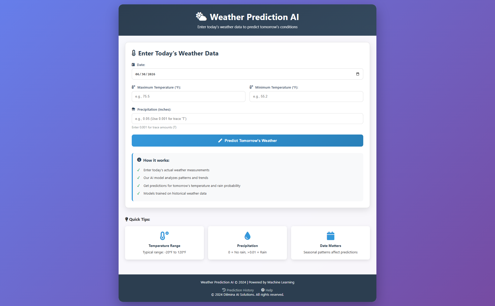
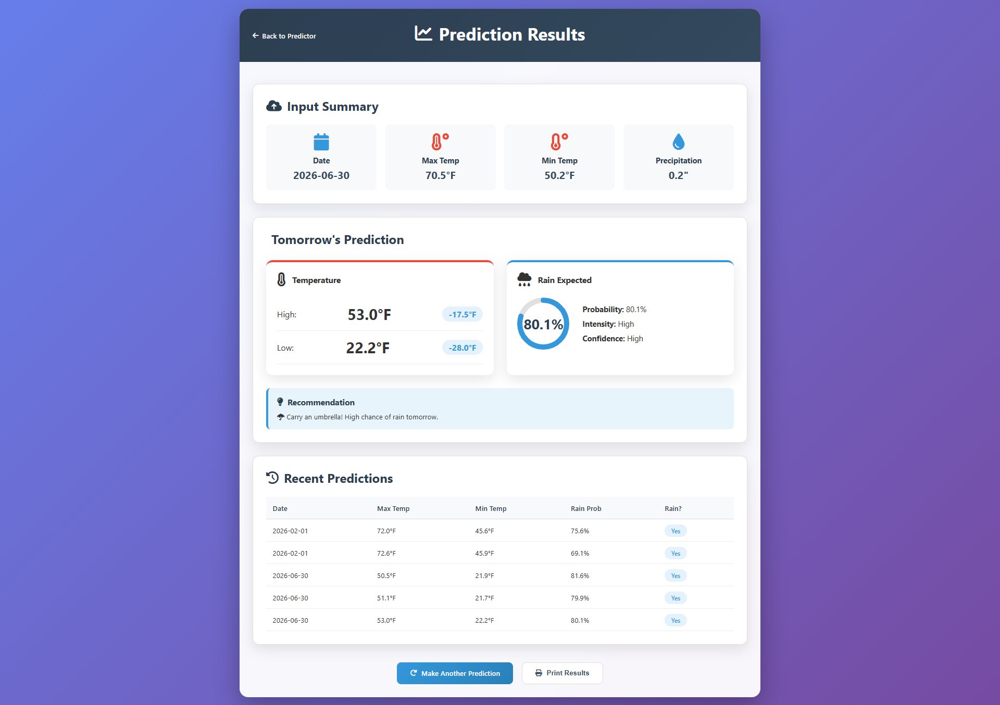

# 🌦️ Weather Prediction 2025

A machine learning project developed for the **Kaggle Weather Prediction 2025** competition. This project predicts weather conditions using machine learning and provides a Flask web application for making real-time predictions.

## 🚀 Features

- Data preprocessing and feature engineering
- Machine learning model training and evaluation
- Weather prediction using trained models
- Flask-based web application
- Interactive user interface
- Model serialization using Pickle (`.pkl`)

## 🛠️ Technologies Used

- Python
- Flask
- Scikit-learn
- Pandas
- NumPy
- HTML
- CSS
- Pickle

## 📂 Project Structure

```text
Weather-Prediction-2025/
├── models/
├── screenshots/
├── static/
├── templates/
├── app.py
├── weather_prediction.ipynb
├── requirements.txt
├── README.md
└── .gitignore
```

## 📸 Application Screenshots

### Weather Input Form



### Prediction Result



## ⚙️ Installation

1. Clone the repository:

```bash
git clone https://github.com/Dilminad/Weather-Prediction-2025.git
```

2. Navigate to the project directory:

```bash
cd Weather-Prediction-2025
```

3. Install the required dependencies:

```bash
pip install -r requirements.txt
```

4. Start the Flask application:

```bash
python app.py
```

## 📌 Project Overview

This project was created as part of the **Kaggle Weather Prediction 2025** competition. It demonstrates the complete machine learning workflow, including data preprocessing, model training, evaluation, and deployment through a Flask web application.

## 👨‍💻 Author

**Dilmina**